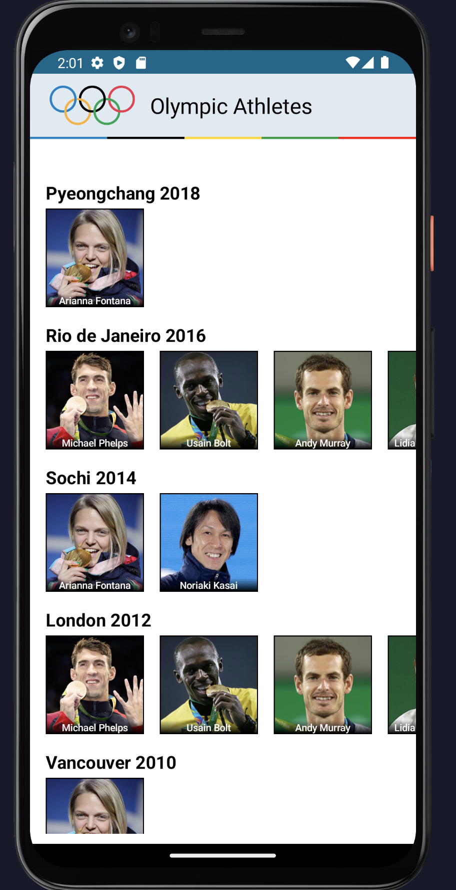
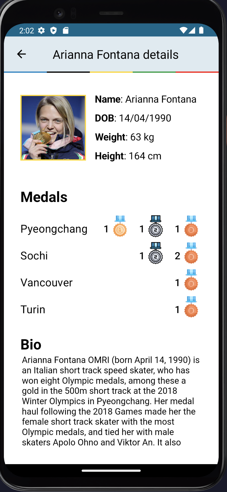
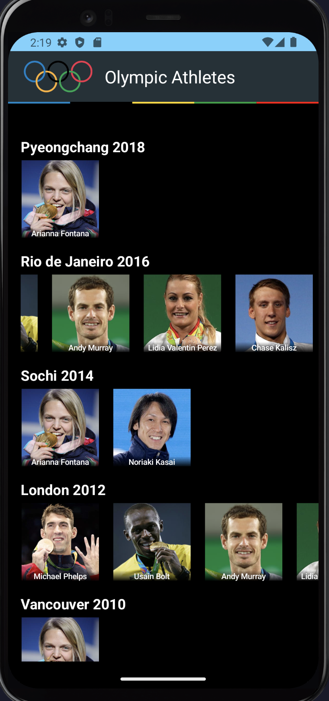
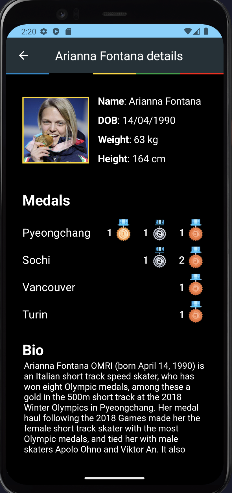

# OlympicAthletes

This is a test application that consumes an API that simulates data about the Olympic games.

To execute it, you only need an up-to-date Android Studio and an emulator with an internet connection.

There is an APK built and provided in the root of this repository. Below are pictures and a video showing the app.

## Screenshots

  
  

  
  

## Video

[Demo on Vimeo](https://vimeo.com/845046843?share=copy)

## Technologies Used

- Jetpack Compose with View Models
- Kotlin Flows and Coroutines
- Retrofit for network communication
- Commonmark for processing Markdown text
- Dagger Hilt for Dependency Injection
- Coil Composable for loading images into Composables
- Navigation Component from Jetpack for navigation

## App Architecture

The app's architecture is very simple, consisting of a single Main Activity with a loaded AppNavigator that manages the two screens in the application. Lint measures weren't used, but the code is still clean and formatted.

A sealed class `NavScreen` was used to store all the navigational routes, as this was a simple two-screen app. `HomeScreen` and `DetailsScreen` were created for their own purposes, consisting of smaller composables, making it easier to make changes to the layout when necessary.

The App Theme uses the general Android Studio new project, so the app and system bar, for example, will have the main colors changing based on the phone screen. The UI changes beautifully between Dark and Light themes.

## Future Improvements

- Improve content loading strategy to reduce initial loading time.
- Introduce a database to cache content and reduce reliance on the internet connection.
- Add repositories and use cases to offload business logic from `HomeViewModel` and make the architecture cleaner.
- If not able to improve loading, apply a loading screen with a % counter for the amount of data loaded and with images/information about the Olympic games while the user waits
